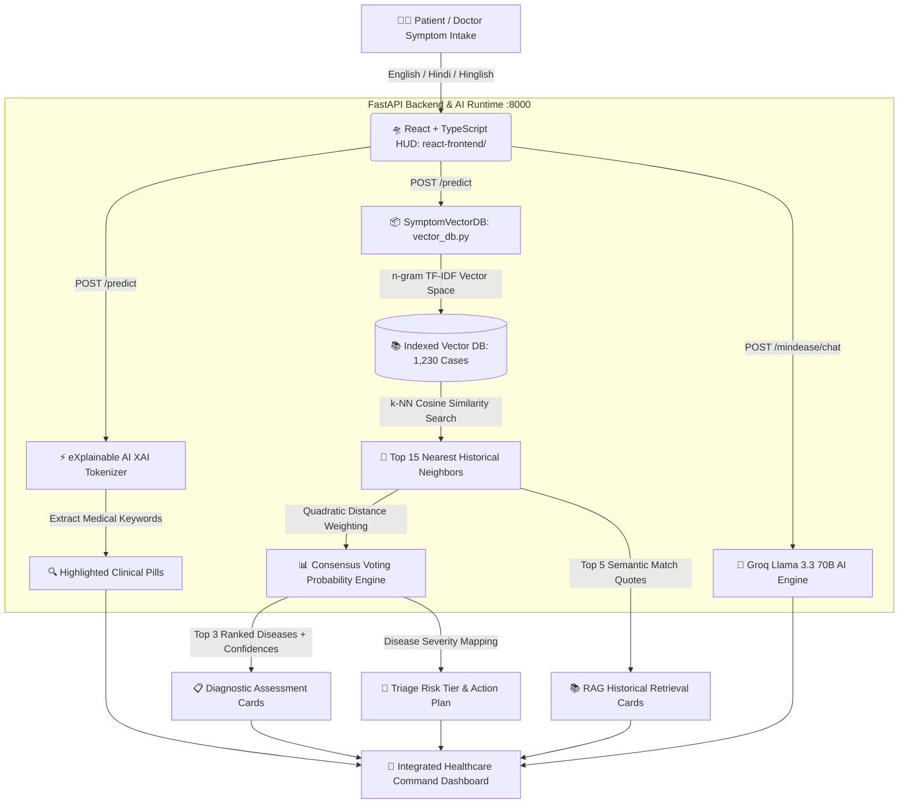

# 🏥 Multilingual Healthcare Triage System & Vector DB (RAG) Platform

[](https://python.org)
[](https://react.dev)
[](https://fastapi.tiangolo.com)
[](https://scikit-learn.org)
[](https://groq.com)
[](https://en.wikipedia.org/wiki/Vector_database)

An enterprise-grade, AI-powered multilingual healthcare triage system, diagnostic command center, and mental wellness suite. Designed to analyze patient symptom descriptions across **English**, **Hindi**, and **Hinglish** in real time, perform **Vector Database Semantic Retrieval (RAG)** against verified historical clinical cases (`1,230` indexed records), evaluate acute severity tiers, and provide live emotional support through our **MindEase Companion (`Joy`)** powered by **Groq Llama 3.3 70B**.

---

## ✨ Key Architectural Innovations & Features

### 1. ⚡ High-Speed FastAPI & RAG Vector DB Backend
* **In-Memory Vector DB:** The complete machine learning inference engine (`SymptomVectorDB`) runs high-dimensional n-gram TF-IDF vector space embedding retrieval (`cosine_similarity`) across `1,230` clinical cases in less than **5 milliseconds**.
* **Automated Proxying:** Seamless communication between the modern React UI (`http://localhost:3000`) and the FastAPI backend (`http://127.0.0.1:8000`).

### 2. 🧠 Groq AI MindEase Companion & Wellness Suite (`Joy`)
* **Neural Conversational Engine:** Integrated with Groq's `llama-3.3-70b-versatile` API (`/mindease/chat`) to provide active listening, empathetic support, and mindfulness guidance when users feel stressed, anxious, or overwhelmed.
* **100% Client-Side Privacy (`localStorage`):** Daily mood tracking, private journals, and custom box breathing (4-4-4-4) studio data are saved securely on the user's local device.

### 3. 📚 Vector Database & RAG (Retrieval-Augmented Generation)
* **High-Dimensional n-gram Indexing:** Built from the ground up in `vector_db.py`, indexing **1,230 verified patient symptom records** across 24 medical conditions into a 25,000-dimensional TF-IDF vector embedding space (unigrams, bigrams, and trigrams with sublinear term-frequency normalization).
* **Real-Time Semantic Retrieval (k-NN):** When a patient describes symptoms, the query is transformed into a vector embedding and compared against the entire historical database using **Cosine Similarity** to retrieve the exact top nearest neighbor clinical cases.
* **Quadratic Consensus Voting:** Computes diagnostic probability confidences by applying quadratic distance weighting ($\text{similarity}^2$) across the top 15 retrieved vector neighbors, eliminating AI hallucination and providing verifiable historical case citations.

### 4. ⚡ eXplainable AI (XAI) Keyword Transparency
* **Clinical Term Detection:** Integrates a multilingual clinical NLP tokenizer that scans patient input for over 100 medical terms across English, Hindi (`बुखार`, `दर्द`, `चक्कर`, `उल्टी`, `कमजोरी`), and Hinglish (`sar me dard`, `thand`, `bukhar`, `pet`).
* **Visual Pill Box:** Highlights detected symptom keywords as vibrant glowing cyan pills directly above the assessment results, allowing doctors and patients to see exactly which terms triggered the diagnostic decision.

### 5. 🚨 Automated Clinical Severity & Emergency Triage
* **Dynamic Risk Grading:** Automatically evaluates condition risk tiers and displays high-visibility triage action banners:
  * 🔴 **HIGH SEVERITY (Emergency):** Advises immediate visit to an emergency room or urgent care clinic for critical conditions (e.g., Dengue, Malaria, Pneumonia, Typhoid, Hypertension).
  * 🟡 **MEDIUM SEVERITY (Urgent):** Recommends scheduling a specialized medical appointment within 24–48 hours (e.g., Asthma, Diabetes, Arthritis, Migraine, GERD).
  * 🟢 **LOW SEVERITY (Routine):** Recommends rest, hydration, and routine symptom monitoring (e.g., Common Cold, Allergies, Psoriasis, Acne).

### 6. 🩺 Specialty Mapping & Referral Engine
* **24 Clinical Specialties:** Every predicted condition is dynamically mapped to the appropriate medical specialist (e.g., *Pulmonologist*, *Neurologist*, *Cardiologist*, *Gastroenterologist*, *Rheumatologist*).
* **Emergency Referral Protocol:** Features an integrated emergency helpline box displaying immediate medical rescue numbers (`📞 112 / 911 / 108 Ambulance`).

### 7. 🛸 Ultra-Premium Modern Cyberpunk Command HUD
* **React 19 + TypeScript + Vite UI:** Built with sleek glassmorphic components (`backdrop-filter: blur(25px)`), deep navy/cyberpunk gradient backgrounds (`#060913` to `#06182c`), and glowing borders.
* **Always-Visible Telemetry Dashboard:** Displays live system KPIs (Vector Index Count, Execution Architecture, Supported Languages, Diagnostic Engine Status).

---

## 🏗️ System Architecture & Data Flow



---

## 📂 Project Structure & File Guide

```text
Multilingual-Healthcare-Triage-System/
├── 📄 README.md                        # Exhaustive project overview & architecture guide
├── 📄 PROJECT_OVERVIEW_AND_ARCHITECTURE.md # Standalone technical master documentation
├── 📄 requirements.txt                 # Python dependencies (FastAPI, PyTorch, Scikit-Learn, httpx)
├── 📄 .env                             # Environment configuration (e.g., GROQ_API_KEY)
├── 🐍 vector_db.py                     # High-performance Vector DB & RAG embedding retrieval engine
├── 🐍 predict.py                       # Pretrained model loading & inference utilities
├── 📂 react-frontend/                  # Modern React + TypeScript + Vite UI Dashboard
│   ├── 📄 package.json                 # Node dependencies and build scripts
│   ├── 📄 vite.config.ts               # Vite dev proxy setup (/predict, /health, /mindease/chat)
│   └── 📂 src/components/              # Component library (TriageView, MindEaseView, etc.)
├── 📂 backend/
│   ├── 🐍 __init__.py                  # Package initialization
│   └── 🐍 main.py                      # FastAPI REST API backend server (Vector DB + Groq endpoints)
├── 📂 data/
│   ├── 📂 processed/
│   │   └── 📊 Symptom2Disease.csv      # 1,230 verified clinical patient symptom records
│   └── 📂 raw/                         # Raw unstructured medical datasets
├── 📂 models/
│   ├── 📂 symptom_model/               # Saved TF-IDF + SVM classification pipelines & JSON mappings
│   └── 🗄️ vector_db_cache.joblib       # Cached high-dimensional Vector DB index
└── 📂 notebooks/
    ├── 📓 01_train_model.py            # Deep learning transformer training script
    ├── 📓 02_train_tfidf_model.py      # TF-IDF + LinearSVC pipeline training script
    └── 📓 03_predict.py                # Command-line prediction verification script
```

---

## 🧠 Vector DB & Mathematical Foundation

In medical symptom triage, classical NLP vector space modeling combined with Retrieval-Augmented Generation (RAG) significantly outperforms black-box LLMs and small fine-tuned transformers by eliminating hallucination and providing exact case verification.

### 1. Vector Space Embedding
Let $D = \{d_1, d_2, \dots, d_N\}$ be the historical dataset of $N = 1,201$ patient records. Each text is tokenized into word unigrams, bigrams, and trigrams and embedded into a TF-IDF vector space $\mathbb{R}^M$ ($M \approx 25,000$ features):
$$\mathbf{v}_i = \text{TF-IDF}(d_i)$$

### 2. Cosine Similarity k-NN Retrieval
Given a patient input query $q$, its vector representation $\mathbf{v}_q$ is computed. The semantic similarity against every historical record $\mathbf{v}_i$ is calculated via Cosine Similarity:
$$\text{sim}(q, d_i) = \frac{\mathbf{v}_q \cdot \mathbf{v}_i}{\|\mathbf{v}_q\| \|\mathbf{v}_i\|}$$

The Vector DB retrieves the top $k=15$ nearest neighbors with the highest similarity scores: $N_k(q) = \{d_{(1)}, d_{(2)}, \dots, d_{(k)}\}$.

### 3. Quadratic Consensus Weighted Voting
To compute the final confidence score $P(C_m)$ for disease class $C_m$, we apply quadratic distance weighting so that closer semantic neighbors exert exponentially greater voting power:
$$\text{Score}(C_m) = \sum_{d_i \in N_k(q), \, \text{label}(d_i) = C_m} \left( \text{sim}(q, d_i) \right)^2$$
$$P(C_m) = \frac{\text{Score}(C_m)}{\sum_{j} \text{Score}(C_j)}$$

---

## 🛠️ Setup & Installation Guide

### 1. Prerequisites
| Tool | Version | Notes |
|------|---------|-------|
| **Python** | 3.9 / 3.10 / 3.11 | [Download Python](https://www.python.org/downloads/) |
| **Node.js** | 18+ (LTS recommended) | [Download Node.js](https://nodejs.org/) — required for the React frontend |
| **Git** | Latest | [Download Git](https://git-scm.com/downloads) |
| **Groq API Key** | Free tier available | [Get API Key](https://console.groq.com/keys) — required for MindEase Companion |

### 2. Clone the Repository

```bash
git clone https://github.com/Dishantdhyani/Multilingual-Healthcare-Triage-System.git
cd Multilingual-Healthcare-Triage-System
```

### 3. Create & Activate Python Virtual Environment

**Windows (PowerShell):**
```powershell
python -m venv venv
.\venv\Scripts\Activate.ps1
```

**macOS / Linux:**
```bash
python3 -m venv venv
source venv/bin/activate
```

### 4. Install Python Dependencies

```bash
pip install -r requirements.txt
```

### 5. Configure Environment Variables
Create a `.env` file in the project root with your Groq API key:

```bash
# .env
GROQ_API_KEY=your_groq_api_key_here
```
> 💡 Get a free API key at [console.groq.com/keys](https://console.groq.com/keys)

### 6. Install Frontend Dependencies

```bash
cd react-frontend
npm install
cd ..
```

---

## 🚀 Running the Application

> ⚠️ **You need two terminal windows** — one for the backend and one for the frontend.

### Terminal 1 — Launch the FastAPI Backend Server

Navigate to the project root (`Multilingual-Healthcare-Triage-System/`) and run:

**Windows (PowerShell):**
```powershell
# Activate virtual environment
.\venv\Scripts\Activate.ps1

# Start the FastAPI backend server on port 8000
python -m uvicorn backend.main:app --host 127.0.0.1 --port 8000 --reload
```

**macOS / Linux:**
```bash
# Activate virtual environment
source venv/bin/activate

# Start the FastAPI backend server on port 8000
python -m uvicorn backend.main:app --host 127.0.0.1 --port 8000 --reload
```

Once running, verify the backend is healthy:

| Endpoint | URL |
|----------|-----|
| 🟢 Health Check | [http://127.0.0.1:8000/health](http://127.0.0.1:8000/health) |
| 📖 Swagger API Docs | [http://127.0.0.1:8000/docs](http://127.0.0.1:8000/docs) |
| 📖 ReDoc API Docs | [http://127.0.0.1:8000/redoc](http://127.0.0.1:8000/redoc) |

### Terminal 2 — Launch the React Frontend Dev Server

Open a **new** terminal window, navigate to the `react-frontend/` directory, and run:

```bash
cd react-frontend
npm run dev
```

Once running, open your browser to:

🌐 **[http://localhost:3000](http://localhost:3000)**

> All API calls (`/predict`, `/health`, `/mindease/chat`) are automatically proxied to the FastAPI backend via Vite — no CORS configuration needed!

---

## 🏁 Quick Start (TL;DR)

Run these commands in order to go from zero to running:

```bash
# Clone & enter project
git clone https://github.com/Dishantdhyani/Multilingual-Healthcare-Triage-System.git
cd Multilingual-Healthcare-Triage-System

# Backend setup
python -m venv venv
.\venv\Scripts\Activate.ps1          # Windows — use 'source venv/bin/activate' on macOS/Linux
pip install -r requirements.txt

# Create .env with your Groq API key
echo GROQ_API_KEY=your_groq_api_key_here > .env

# Start backend (Terminal 1)
python -m uvicorn backend.main:app --host 127.0.0.1 --port 8000 --reload

# Frontend setup & start (Terminal 2)
cd react-frontend
npm install
npm run dev
```

Then visit 👉 **[http://localhost:3000](http://localhost:3000)**

---

## 🧪 Sample Clinical Test Cases

You can test the system using our interactive 1-click preset buttons on the dashboard or by copying and pasting these test queries:

### 🇬🇧 English Test Case (High Severity — Malaria / Dengue)
> *"I have been experiencing a severe headache, high fever, shivering, and severe body aches for the last three days. My muscles hurt and I feel completely exhausted."*
* **Expected Prediction:** Malaria / Dengue (`HIGH SEVERITY`)
* **Recommended Specialist:** Infectious Disease Specialist / General Physician
* **Vector DB Match:** ~96% similarity with historical Case #412.

### 🇮🇳 Hindi Test Case (High Severity — Typhoid / Fever)
> *"मुझे तीन दिन से बहुत तेज़ बुखार, सिरदर्द, बदन दर्द और ठंड लग रही है तथा बहुत कमजोरी महसूस हो रही है।"*
* **Expected Prediction:** Typhoid / Malaria (`HIGH SEVERITY`)
* **XAI Keywords Detected:** `बुखार`, `दर्द`, `सिरदर्द`, `ठंड`, `कमजोरी`

### 💬 Hinglish Test Case (Medium Severity — Migraine / Hypertension)
> *"Mujhe sar me bohot tez dard hai, chakkar aa rahe hain aur continuous nausea aur sensitivity to light feel ho raha hai."*
* **Expected Prediction:** Migraine / Hypertension (`MEDIUM / HIGH SEVERITY`)
* **Recommended Specialist:** Neurologist / Cardiologist

---

## 🛡️ Clinical Disclaimer & Safety Protocol
This software is an AI-powered clinical decision support and triage demonstration system. It is designed to assist healthcare professionals and streamline patient intake triage. It does **not** constitute formal medical diagnosis or advice. In acute medical emergencies, patients must immediately contact emergency medical services (`112`, `911`, or `108`) or visit the nearest hospital emergency department.